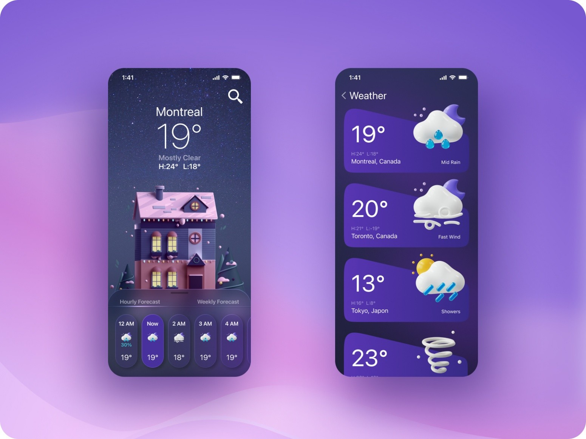

# 🌦️ Weather App

A professional Flutter application developed for the **Mobile Application Development** course at **Helwan National University (HNU)**.

---

<p align="center">
  
  <br>
  <i>Project Demonstration Interface</i>
</p>

---

## 👨‍💻 About the Project
This project was developed by **Polla Joseph** and **Marllen Sery**, 4th-year students at HNU. 

Due to the professional quality and technical standards of this application, we were selected by **Dr. Hany Gouda** to provide this project as a primary reference and demonstration for our fellow students and the Teaching Assistants (TAs) of the Mobile Application Subject.

## 📝 Project Description
The **Weather App** is a high-performance mobile application designed to provide users with accurate, real-time meteorological data. It serves as a practical guide for students to understand asynchronous data handling and clean architecture in Flutter.

### 🛠️ Technical Highlights
* **API Integration:** The app is powered by the **[WeatherAPI](https://www.weatherapi.com/)**, fetching comprehensive data including current temperature, conditions, and atmospheric details.
* **JSON Parsing:** Expertly handles complex JSON responses from WeatherAPI endpoints, mapping them into custom Dart models.
* **Modern UI/UX:** Designed with Flutter's latest Material Design widgets to ensure a smooth, responsive user experience.
* **Error Handling:** Implements robust logic for scenarios like "No Internet Connection" or "City Not Found."

---

## 🚀 Getting Started

If this is your first Flutter project, here are a few resources to get you started:

- [Lab: Write your first Flutter app](https://docs.flutter.dev/get-started/codelab)
- [Cookbook: Useful Flutter samples](https://docs.flutter.dev/cookbook)
- [Online Documentation](https://docs.flutter.dev/)

### Installation

1.  **Clone the repository:**
    ```bash
    git clone [https://github.com/PollaJoseph/weather_app.git](https://github.com/PollaJoseph/weather_app.git)
    ```
2.  **Install dependencies:**
    ```bash
    flutter pub get
    ```
3.  **Run the application:**
    ```bash
    flutter run
    ```

---

## 🎓 Academic Context
* **University:** Helwan National University (HNU)
* **Year:** 4th Year (2025-2026)
* **Subject:** Mobile Application Development
* **Supervised by:** Dr. Hany Gouda

---
© 2026 Polla Joseph & Marllen Sery. Built with ❤️ using Flutter.
